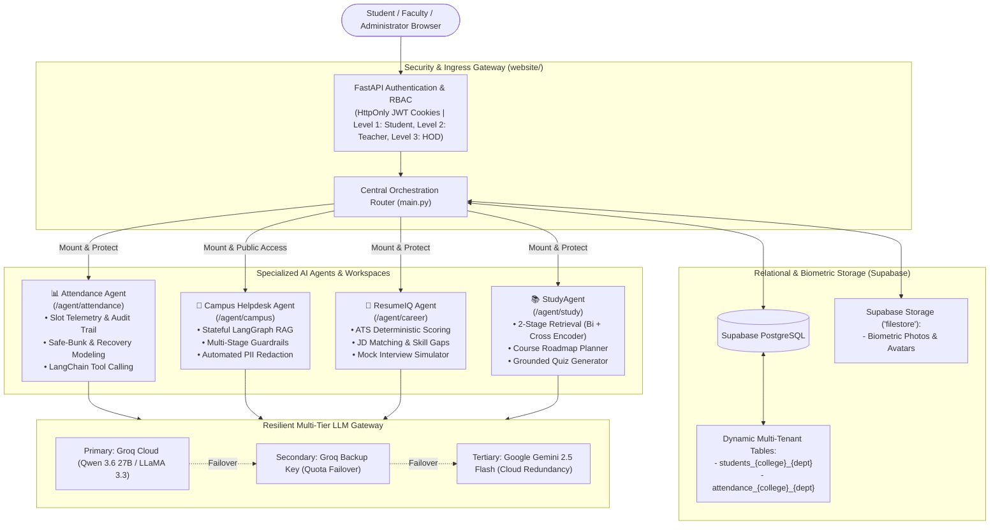

# 🎓 CampusOS: The Autonomous Multi-Agent Campus Operating System

**CampusOS** is an enterprise-grade, modular multi-agent platform designed to unify institutional campus governance, student intelligence, and autonomous AI workflows into a single ecosystem.

Built on **FastAPI**, **LangChain / LangGraph**, **Supabase PostgreSQL**, **ChromaDB**, and a resilient multi-tier LLM gateway (**Groq** + **Google Gemini**), CampusOS provides students, faculty, and administrators with specialized AI agents for attendance tracking, campus inquiries, resume optimization, and academic study assistance.

---

## 📑 Table of Contents

- [🏛️ Ecosystem Architecture](#️-ecosystem-architecture)
- [🧩 Core Sub-Systems & Agents](#-core-sub-systems--agents)
  - [1. 🌐 CampusOS Web Platform (`website/`)](#1--campusos-web-platform-website)
  - [2. 📊 Attendance Intelligence Agent (`attendance_agent/`)](#2--attendance-intelligence-agent-attendance_agent)
  - [3. 💬 Campus Helpdesk Agent (`helpdesk_agent/`)](#3--campus-helpdesk-agent-helpdesk_agent)
  - [4. 💼 ResumeIQ Agent (`resume_agent/`)](#4--resumeiq-agent-resume_agent)
  - [5. 📚 Academic StudyAgent (`study_agent/`)](#5--academic-studyagent-study_agent)
- [🛡️ Resiliency, Security & Guardrails](#️-resiliency-security--guardrails)
- [📁 Repository Structure](#-repository-structure)
- [🚀 Quick Start & Installation](#-quick-start--installation)
- [⚙️ Environment Configuration](#️-environment-configuration)
- [🤝 Contributing & License](#-contributing--license)

---

## 🏛️ Ecosystem Architecture

CampusOS operates as a hub-and-spoke system where the central Web Platform acts as the gateway and orchestrator, mounting and proxying specialized sub-agents with unified session security and database isolation:



---

## 🧩 Core Sub-Systems & Agents

### 1. 🌐 CampusOS Web Platform (`website/`)
The central administrative portal and multi-tenant management gateway:
* **Role-Based Access Control (RBAC)**: 3-tier hierarchical security (`HOD` > `Teacher` > `Student`) with signed `HS256` JWTs stored in `HttpOnly` cookies.
* **Dynamic Table Isolation**: Automatically provisions dedicated tables (`students_{college}_{dept}` and `attendance_{college}_{dept}`) per classroom to prevent monolithic bottlenecks and guarantee cross-tenant privacy.
* **Analytics & Defaulter Engine**: Real-time calculation of student percentages, safe-slot recovery buffers, active attendance streaks, and classroom CSV roster exports.
* **Frictionless Onboarding**: Secure invite links for teacher self-registration and student roster enrollment with facial photo uploads.
* **Embedded Platform RAG**: Instant conversational assistance on platform features powered by in-memory ChromaDB and Groq inference.

### 2. 📊 Attendance Intelligence Agent (`attendance_agent/`)
An enterprise conversational agent for attendance telemetry:
* **Zero-Hallucination Attendance Q&A**: Answers attendance inquiries strictly using sanitized database records from Supabase.
* **Slot & Audit Normalization**: Resolves complex slot structures (e.g., `slot_09_00_10_00`) with teacher assignments and modification audit trails.
* **Predictive Forecasting Engine**: Calculates classes needed to achieve attendance criteria ($75\%+$) and computes safe skippable slots (bunks allowed).
* **Perimeter Guardrails**: Rejects off-topic, chit-chat, or coding queries before invoking the LLM.

### 3. 💬 Campus Helpdesk Agent (`helpdesk_agent/`)
A stateful, 4-node LangGraph RAG assistant for institutional knowledge:
* **LangGraph State Machine**: Transitions deterministically through `validate_input` $\rightarrow$ `retrieve` $\rightarrow$ `generate` $\rightarrow$ `validate_output`.
* **Campus Policy Knowledge Base**: Ingests college handbooks, fee schedules, hostel regulations, and academic calendars into ChromaDB.
* **Comprehensive Guardrails**: Prompt injection defense (regex patterns), harmful query blocking, and automatic output PII masking (emails and phone numbers).
* **Session Summarizer**: Compresses multi-turn dialogues into rolling narratives using LangGraph checkpointers.

### 4. 💼 ResumeIQ Agent (`resume_agent/`)
A career advisory intelligence system for students and placement cells:
* **ATS Diagnostic Scoring**: Deterministic 100-point scoring algorithm auditing contact info, technical skills, projects, work experience, and structural integrity.
* **Job Description Matching**: TF-IDF cosine similarity combined with skill matrix intersection to compute candidate match percentages and classify placement eligibility (`Eligible`, `Borderline`, `Not Eligible`).
* **Skill Gap Analysis & Interview Prep**: Extracts missing competencies and generates targeted technical/behavioral interview questions grounded directly in the candidate's resume.
* **6 Operational Modes**: Dynamic intent detection routing between Resume Review, Eligibility Checking, Skill Gap Analysis, Interview Prep, Coding Practice, and Career Path Guidance.

### 5. 📚 Academic StudyAgent (`study_agent/`)
A verified academic learning assistant grounded in user-uploaded course documents:
* **Two-Stage Retrieval Pipeline**: Combines dense semantic search (Bi-Encoder: `all-MiniLM-L6-v2`, $k=8$) with neural re-ranking (Cross-Encoder: `ms-marco-MiniLM-L-6-v2`, top 3) to eliminate retrieval noise.
* **Study Planning**: Synthesizes customized multi-day revision roadmaps and chapter sequencing from syllabi.
* **Assignment Guidance**: Provides step-by-step mathematical and conceptual problem-solving strictly grounded in course notes.
* **Grounded Quiz Generation**: Generates 4-option MCQs with verified answer keys and source citations.

---

## 🛡️ Resiliency, Security & Guardrails

| Feature | Implementation | Benefit |
| :--- | :--- | :--- |
| **Failover LLM Gateway** | Groq (`qwen/qwen3.6-27b`) $\rightarrow$ Secondary Groq $\rightarrow$ Google Gemini (`gemini-2.5-flash`) | Continuous 99.9% uptime; immunity to single-provider rate limits or outages. |
| **Input Guardrails** | Regex pattern matching for 20+ prompt-injection, jailbreak, and system override attempts. | Prevents model hijacking and off-topic compute drain. |
| **Output Guardrails** | Automated PII masking for emails and telephone numbers. | Protects student and faculty privacy in generated responses. |
| **Strict Grounding** | Few-shot prompts with zero-hallucination instructions and document attribution. | Eliminates factual fabrications in academic and policy queries. |
| **Session Isolation** | Checkpointed state indexed by `session_id` / `thread_id`. | Prevents cross-talk and preserves multi-turn conversation memory. |

---

## 📁 Repository Structure

```
campusOS/
├── main.py                      # 🚀 Root entry point (runs CampusOS from root)
├── .env.example                 # Environment variables template
├── .gitignore                   # Master Git ignore rules
├── README.md                    # Root project documentation (this file)
│
├── website/                     # 🌐 Central Web Platform & Sub-Agent Gateway
│   ├── main.py                  # Core FastAPI application & agent mounting
│   ├── auth.py                  # JWT authentication & RBAC middleware
│   ├── utils.py                 # Supabase client & dynamic table management
│   ├── templates/               # Jinja2 HTML templates for all dashboards
│   ├── static/                  # Glassmorphic CSS stylesheets & client JS
│   ├── data/                    # Platform documentation & knowledge base
│   └── README.md                # Dedicated Web Platform documentation
│
├── attendance_agent/            # 📊 Attendance Intelligence Agent
│   ├── src/attendance_agent/    # Core agent logic, tools, and guardrails
│   ├── web/                     # Dedicated web dashboard & FastAPI runner
│   ├── pyproject.toml           # Package configuration
│   └── README.md                # Dedicated Attendance Agent documentation
│
├── helpdesk_agent/              # 💬 Campus Helpdesk RAG Agent
│   ├── src/helpdesk_agent/      # LangGraph state machine, loaders, & prompts
│   ├── data/documents/          # Campus handbooks & policy reference files
│   ├── web/                     # Helpdesk web interface
│   ├── pyproject.toml           # Package configuration
│   └── README.md                # Dedicated Helpdesk Agent documentation
│
├── resume_agent/                # 💼 ResumeIQ Career Advisory Agent
│   ├── src/resume_agent/        # ATS scoring engine, JD matcher, & tool suite
│   ├── web/                     # Multi-resume upload dashboard & REST API
│   ├── pyproject.toml           # Package configuration
│   └── README.md                # Dedicated ResumeIQ Agent documentation
│
└── study_agent/                 # 📚 Academic StudyAgent RAG
    ├── src/study_agent/         # Two-stage retrieval, re-ranker, & planners
    ├── web/                     # Academic assistant interface & quiz runner
    ├── pyproject.toml           # Package configuration
    └── README.md                # Dedicated StudyAgent documentation
```

---

## 🚀 Quick Start & Installation

### Prerequisites
* **Python**: `3.10` or higher
* **Supabase Account**: A Supabase project with PostgreSQL database and a storage bucket named `filestore`.
* **API Keys**:
  * [Groq Cloud API Key](https://console.groq.com/) (Primary & optional secondary key)
  * [Google AI Studio Gemini API Key](https://aistudio.google.com/) (Fallback)

### 1. Clone & Set Up Environment
```bash
git clone https://github.com/your-username/campusOS.git
cd campusOS

# Create a virtual environment
python -m venv .venv
source .venv/bin/activate  # On Windows: .venv\Scripts\activate
```

### 2. Configure Environment Variables
Copy the `.env.example` template to `.env` in the root directory (and/or inside the respective agent folders if running standalone):
```bash
cp .env.example .env
```
Fill in your credentials in `.env`:
```ini
SUPABASE_URL=https://your-project.supabase.co
SUPABASE_KEY=your-supabase-service-or-anon-key
JWT_SECRET=your-strong-random-jwt-secret
GROQ_API_KEY=gsk_your_primary_groq_key
GROQ_API_KEY0=gsk_your_backup_groq_key
GEMINI_API_KEY=AIzaSy_your_gemini_key
```

### 3. Install Dependencies
You can install dependencies for the central web platform:
```bash
pip install -r website/requirements.txt
```
To run specific agents standalone, install their respective requirements:
```bash
pip install -r attendance_agent/requirements.txt
pip install -r helpdesk_agent/requirements.txt
pip install -r resume_agent/requirements.txt
pip install -r study_agent/requirements.txt
```

### 4. Launch CampusOS Platform
You can now start the entire platform directly from the root directory:
```bash
python main.py
# or
uvicorn main:app --host 0.0.0.0 --port 8000 --reload
```
Open your browser and navigate to:
* **Landing Page**: [http://localhost:8000](http://localhost:8000)
* **Login Portal**: [http://localhost:8000/login](http://localhost:8000/login)
* **API Documentation**: [http://localhost:8000/docs](http://localhost:8000/docs)

Once running, the central platform automatically mounts:
- **Study Agent**: `http://localhost:8000/agent/study`
- **ResumeIQ Agent**: `http://localhost:8000/agent/career`
- **Attendance Agent**: `http://localhost:8000/agent/attendance`
- **Campus Helpdesk**: `http://localhost:8000/agent/campus`

---

## ⚙️ Environment Configuration

| Variable | Required | Description | Default |
| :--- | :--- | :--- | :--- |
| `SUPABASE_URL` | **Yes** | HTTPS URL of your Supabase project instance. | _None_ |
| `SUPABASE_KEY` | **Yes** | Supabase API key (anon or service role). | _None_ |
| `JWT_SECRET` | **Yes** | Secret string used for signing authentication cookies. | Predefined fallback |
| `GROQ_API_KEY` | **Yes** | Primary API key for high-speed Groq LLM inference. | _None_ |
| `GROQ_API_KEY0` | No | Secondary backup Groq key for rate limit failover. | _None_ |
| `GEMINI_API_KEY` | **Yes** | Google Gemini API key for provider redundancy. | _None_ |
| `GROQ_MODEL` | No | Model name for Groq inference. | `qwen/qwen3.6-27b` |
| `GEMINI_MODEL` | No | Model name for Gemini fallback. | `gemini-2.5-flash` |
| `LOG_LEVEL` | No | Logging verbosity (`DEBUG`, `INFO`, `WARNING`, `ERROR`). | `INFO` |

---

## 🤝 Contributing & License

1. Fork the Project.
2. Create your Feature Branch (`git checkout -b feature/AmazingFeature`).
3. Commit your Changes (`git commit -m 'Add some AmazingFeature'`).
4. Push to the Branch (`git push origin feature/AmazingFeature`).
5. Open a Pull Request.

Distributed under the **MIT License**. See `LICENSE` for more information.
