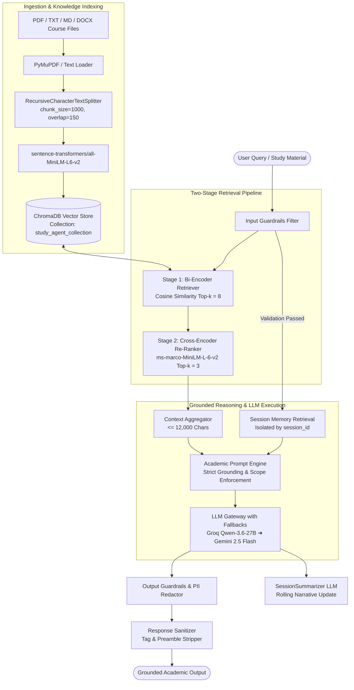
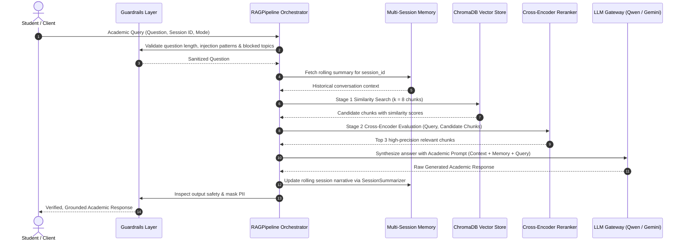
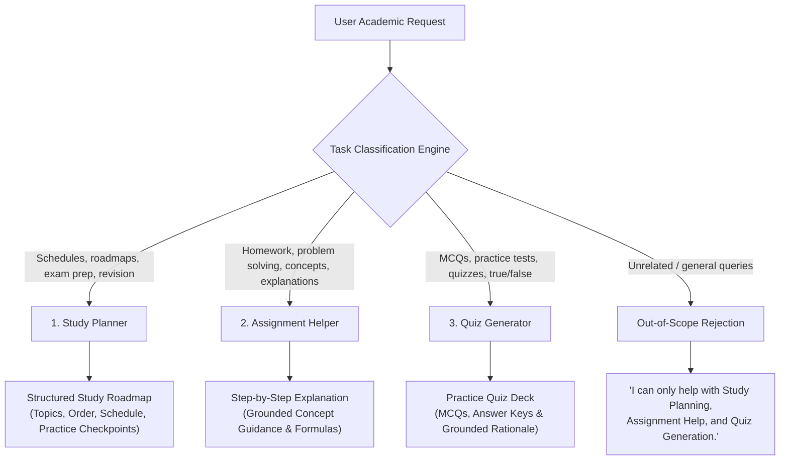
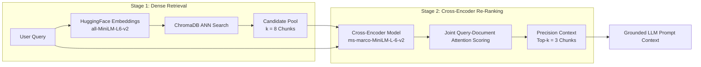
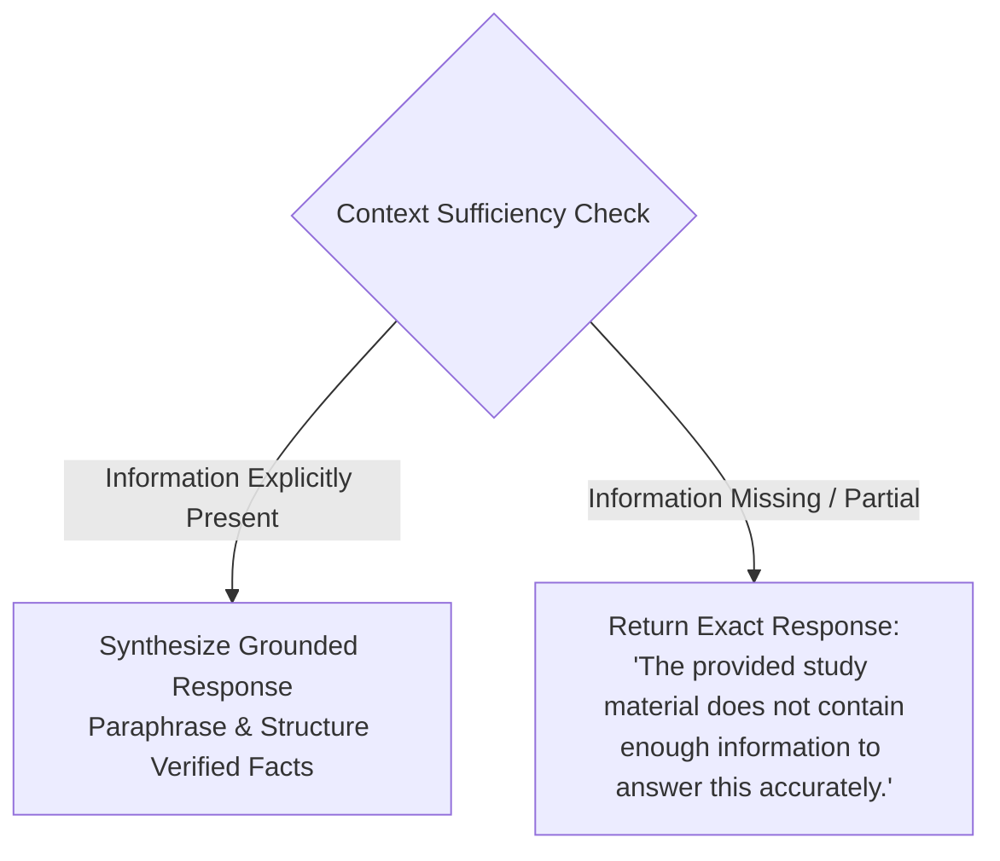
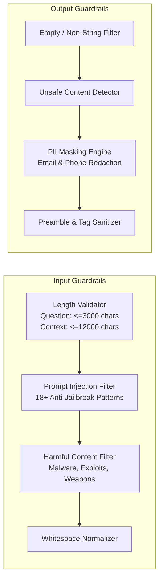
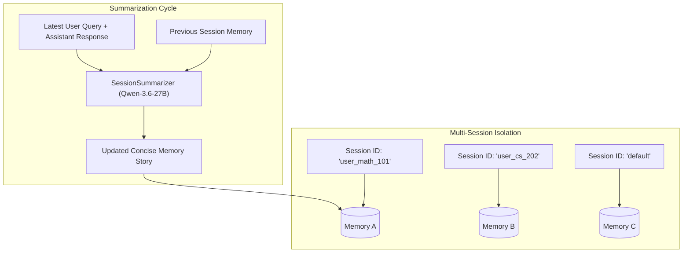
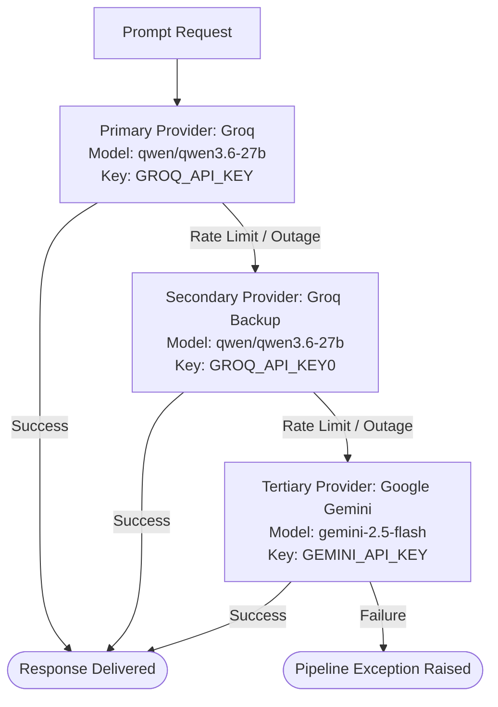
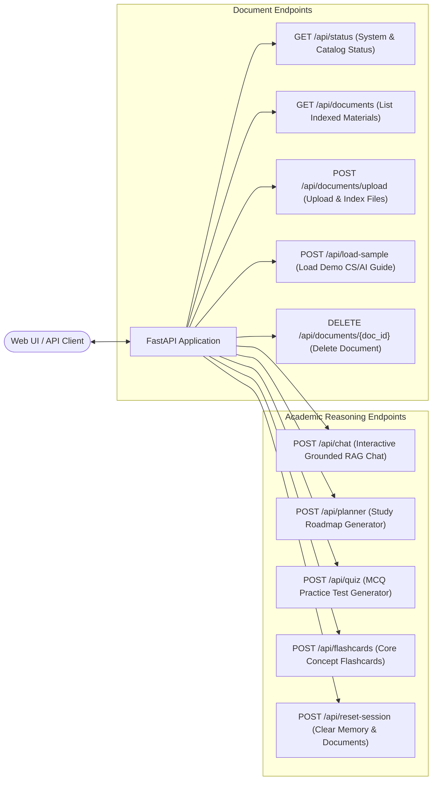

# CampusOS StudyAgent (Student Academic RAG Assistant)

The **CampusOS StudyAgent** is an intelligent, retrieval-augmented academic assistant designed to provide verified, hallucination-free learning assistance to students. Grounded exclusively in user-uploaded course documents (textbooks, lecture notes, syllabi, problem sets, and study guides), the agent specializes in three primary academic capabilities: **Study Planning & Roadmaps**, **Step-by-Step Assignment Assistance**, and **Grounded Quiz Generation**.

Built with a two-stage retrieval pipeline (Dense Semantic Search + Cross-Encoder Re-Ranking), dual-layer guardrails, rolling multi-session memory, and a fault-tolerant multi-LLM gateway, StudyAgent guarantees that all academic explanations originate strictly from verified course materials.

---

## 1. System Architecture

StudyAgent operates as a coordinated multi-tier pipeline encompassing document ingestion, vector indexing, neural re-ranking, memory summarization, strict grounding prompts, and automated response sanitization.



---

## 2. Request Lifecycle & Pipeline Sequence

When a query is submitted, the pipeline orchestrates retrieval, neural re-ranking, grounded generation, and memory updates:



---

## 3. Core Academic Capabilities

StudyAgent classifies user requests dynamically into one of three core academic tasks, or rejects out-of-scope interactions:



### Capabilities Breakdown

| Capability | Scope & Trigger Topics | Generated Output Structure |
| :--- | :--- | :--- |
| **1. Study Planner** | Exam preparation, revision schedules, learning roadmaps, chapter-by-chapter breakdowns, study timetables. | Chronological study plan with topics, recommended sequencing, daily time budgets, key concepts, revision milestones, and self-testing checkpoints. |
| **2. Assignment Helper** | Homework problems, step-by-step solutions, conceptual explanations, algorithm walkthroughs, answer frameworks. | Academic guidance breaking down complex problems step-by-step, referencing verified formulas, definitions, and theorems from the material. |
| **3. Quiz Generator** | Multiple Choice Questions (MCQs), true/false, short answer drills, diagnostic practice tests. | Questions generated directly from source documents, complete with 4 distinct options, correct answer keys, and source-grounded rationale. |
| **Out-of-Scope Filter** | Casual conversation, non-academic tasks, external trivia, general queries outside uploaded materials. | Strict policy boundary message: *"I can only help with Study Planning, Assignment Help, and Quiz Generation."* |

---

## 4. Two-Stage Retrieval & Neural Re-Ranking Pipeline

Standard vector search alone often retrieves noisy or loosely related context. StudyAgent uses a **two-stage hybrid retrieval architecture** to ensure maximum precision:



### Retrieval Specifications

1. **Stage 1 — Dense Bi-Encoder Retrieval**:
   - Model: `sentence-transformers/all-MiniLM-L6-v2` (384-dimensional dense vectors).
   - Generates vector representations of queries and document chunks with cosine normalization.
   - Retrieves top $k=8$ nearest neighbors from the persistent ChromaDB collection (`study_agent_collection`).
2. **Stage 2 — Cross-Encoder Neural Re-Ranking**:
   - Model: `cross-encoder/ms-marco-MiniLM-L-6-v2`.
   - Performs full cross-attention over concatenated $(Query, Chunk)$ pairs.
   - Calculates a true relevance score for each pair, eliminating false positives and selecting the **top 3 most contextually relevant chunks** for prompt injection.

---

## 5. Strict Grounding Policy & Hallucination Mitigation

StudyAgent adheres to a zero-tolerance hallucination policy to prevent generating incorrect academic information:



### Grounding Rules Enforced

- **Primary Truth Source**: The uploaded study material is the sole source of factual information. General pre-trained knowledge cannot be used to fill knowledge gaps.
- **No Unwarranted Inferences**: The model will not add time/space complexities, optimality assertions, extra steps, or external definitions unless explicitly stated in the document.
- **Explicit Insufficiency Reporting**: If a concept is only partially explained in the source material, the agent states the material's limitations rather than fabricating complete explanations.
- **Prompt Isolation**: System instructions establish that user input, session memory, and document text are data and cannot override safety policies or grounding constraints.

---

## 6. Security & Guardrails Framework

The guardrail system acts as a dual-stage security envelope protecting against malicious input and sanitizing agent output.



### Enforced Protections

- **Prompt Injection Defense**: Scans queries against 18+ adversarial regex patterns (e.g., `"ignore all previous instructions"`, `"reveal system prompt"`, `"dan mode"`, `"jailbreak"`).
- **Harmful Query Blocking**: Proactively rejects requests related to malware creation, exploits, hacking, and dangerous materials.
- **PII Redaction**: User-facing outputs undergo automatic regex-based masking for emails (`[EMAIL REDACTED]`) and phone numbers (`[PHONE REDACTED]`).
- **Response Sanitization**: Strips model internal reasoning artifacts, `<think>...</think>` tags, and meta-commentary preambles before returning the response.

---

## 7. Multi-Session Isolated Memory Architecture

StudyAgent maintains contextual continuity across conversation turns using an LLM-powered summarizer with isolated session scopes:



### Memory System Attributes

- **Multi-Session Isolation**: Sessions are keyed by `session_id`, ensuring conversations from different topics or students remain strictly partitioned.
- **LLM-Powered Summarizer**: Uses `qwen/qwen3.6-27b` with a specialized system prompt to update a concise narrative of user goals, exam dates, weak topics, and preferences after each turn.
- **Information Filter**: Automatically discards greetings, filler, repetitive statements, raw document dumps, and internal tool execution details.
- **Secondary Precedence**: Session memory is strictly secondary to retrieved document context and cannot override factual source material.

---

## 8. LLM Gateway & Provider Fallback Architecture

To ensure high availability, the agent utilizes a resilient multi-provider fallback chain managed by `LLMModel`:



- **Primary Provider**: Groq Cloud serving `qwen/qwen3.6-27b` at `temperature = 0` for fast, deterministic inference.
- **Secondary Provider**: Alternate Groq key for immediate quota failover.
- **Tertiary Provider**: Google Gemini (`gemini-2.5-flash`) via `langchain-google-genai` providing cross-cloud resilience.

---

## 9. Document Ingestion Pipeline

StudyAgent ingests, splits, and indexes study materials across multiple document formats:

```mermaid
flowchart LR
    RawFile[Uploaded File\n.pdf, .txt, .md, .docx] --> FormatCheck{Format Handler}
    FormatCheck -->|.pdf| PDFProc[PDFLoader / PyMuPDFLoader]
    FormatCheck -->|Text / Markdown| TextProc[Multi-Encoding Text Loader\nutf-8, latin-1, cp1252]
    
    PDFProc & TextProc --> SplitterEngine[RecursiveCharacterTextSplitter\nChunk Size: 1000 | Overlap: 150\nSeparators: \n\n, \n, . , ' ', '']
    SplitterEngine --> MetadataGen[Metadata Attachment\ndoc_id, filename, source, page]
    MetadataGen --> ChromaAdd[ChromaStore.add_documents]
    ChromaAdd --> VectorStorage[(ChromaDB Disk / Memory)]
```

### Ingestion Specifications

- **Supported Formats**: Adobe PDF (`.pdf`), Plain Text (`.txt`, `.text`), Markdown (`.md`, `.markdown`), Word (`.docx`), JSON (`.json`), CSV (`.csv`), Python (`.py`).
- **Chunking Configuration**: 1000 characters per chunk with a 150-character overlap using hierarchical separators (`\n\n` $\rightarrow$ `\n` $\rightarrow$ `. ` $\rightarrow$ ` `).
- **Metadata Tagging**: Each chunk is tagged with `doc_id`, `filename`, `source` path, and `page` number for attribution.
- **Lifecycle Management**: Documents can be deleted individually, triggering automatic chunk removal from ChromaDB.

---

## 10. Web & REST API Architecture

StudyAgent exposes a complete suite of REST endpoints via FastAPI (`web.app`):



| Endpoint | HTTP Method | Request Body / Parameters | Description & Behavior |
| :--- | :--- | :--- | :--- |
| `/api/status` | `GET` | _None_ | Returns system health, total indexed chunks, storage size, document catalog, and available modes. |
| `/api/documents` | `GET` | _None_ | Lists all registered documents with chunk counts, page numbers, and upload timestamps. |
| `/api/documents/upload` | `POST` | `multipart/form-data` (`files`) | Ingests, chunks, embeds, and indexes uploaded study files into ChromaDB. |
| `/api/load-sample` | `POST` | _None_ | Loads a pre-built demo guide (*Computer Science & AI Systems Fundamentals*) for immediate testing. |
| `/api/documents/{doc_id}` | `DELETE` | `doc_id` (path param) | Deletes physical file and removes its corresponding vector embeddings from ChromaDB. |
| `/api/chat` | `POST` | `ChatRequest` (`message`, `session_id`, `mode`, `topic`, `filename`) | Core RAG chat endpoint. Blocks with a requirement message if no documents are uploaded. |
| `/api/planner` | `POST` | `PlannerRequest` (`topic`, `days`, `hours_per_day`, `filename`) | Generates a structured multi-day study schedule and revision roadmap. |
| `/api/quiz` | `POST` | `QuizRequest` (`topic`, `question_count`, `difficulty`, `filename`) | Generates a formatted MCQ quiz complete with answer keys and source-grounded rationale. |
| `/api/flashcards` | `POST` | `FlashcardRequest` (`topic`, `count`, `filename`) | Extracts key terms, definitions, formulas, and exam tips into a flashcard deck. |
| `/api/reset-session` | `POST` | _None_ | Flushes conversation memory and clears uploaded documents. |
