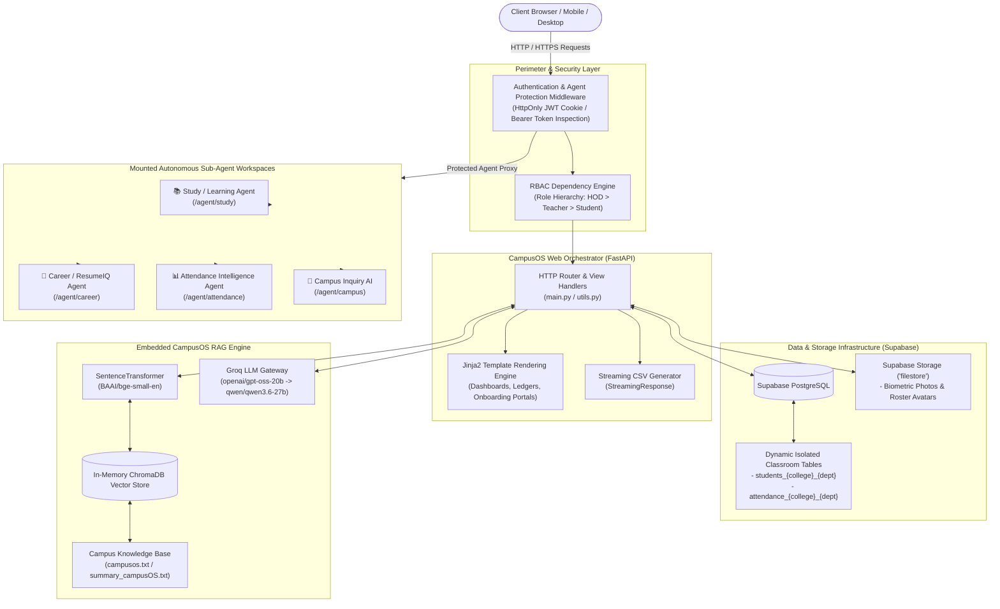
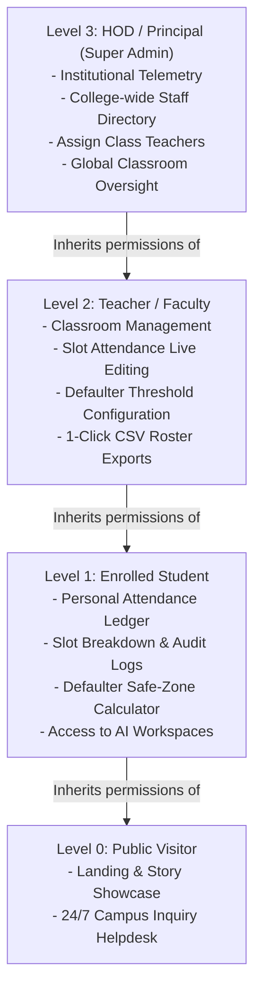
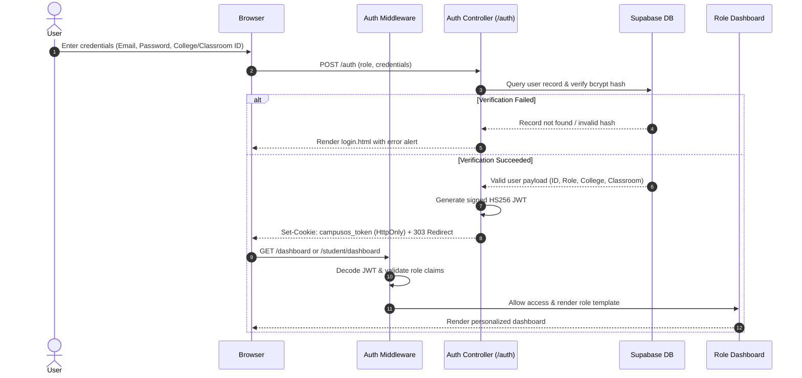
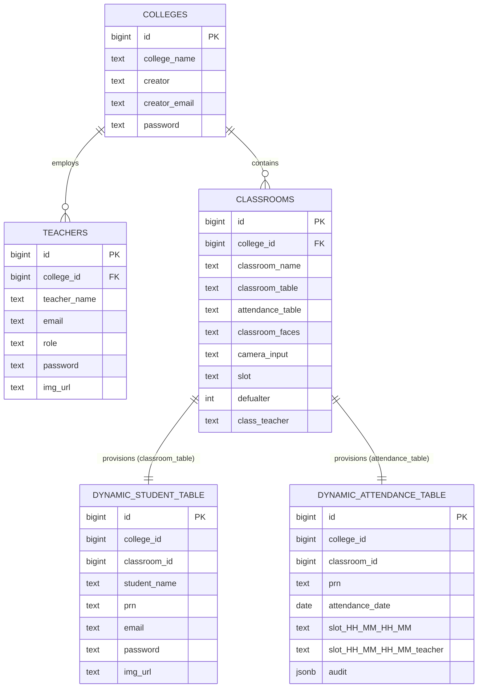
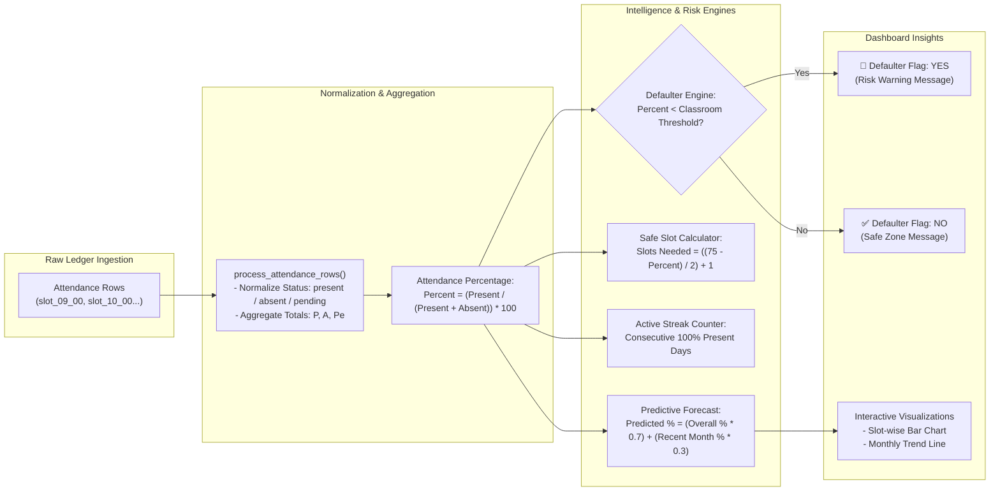
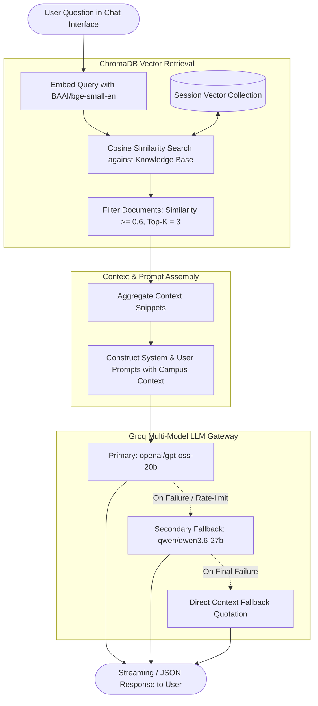
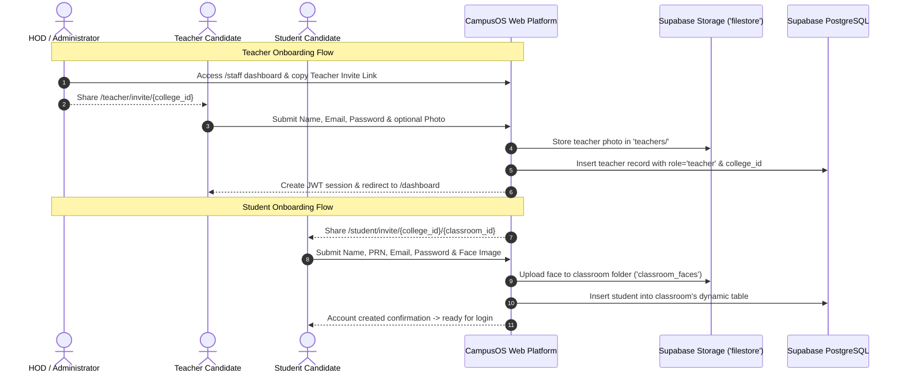
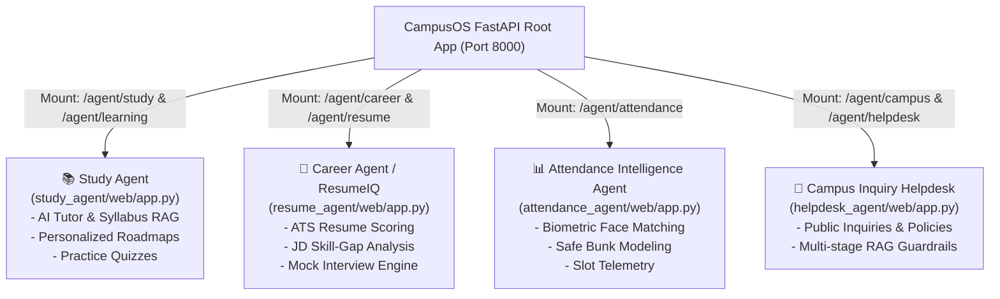

# 🌐 CampusOS Web Platform & Central Orchestrator

The **CampusOS Web Platform (`website/`)** serves as the central orchestration gateway, administrative management layer, and unified multi-agent portal of the CampusOS ecosystem. It bridges institutional governance, classroom administration, personal student analytics, and autonomous AI sub-agents into a single, high-performance web environment powered by **FastAPI**, **Supabase PostgreSQL**, **ChromaDB**, and **Groq LLMs**.

---

## 📑 Table of Contents

- [🏛️ System Architecture](#️-system-architecture)
- [🔐 Authentication & Role-Based Access Control (RBAC)](#-authentication--role-based-access-control-rbac)
- [🗄️ Dynamic Database Schema & Isolation Model](#️-dynamic-database-schema--isolation-model)
- [📊 Analytics, Forecasting & Defaulter Engine](#-analytics-forecasting--defaulter-engine)
- [🤖 Embedded RAG Intelligent Assistant](#-embedded-rag-intelligent-assistant)
- [🔗 Frictionless Link-Based Onboarding](#-frictionless-link-based-onboarding)
- [🎛️ Sub-Agent Application Mounting & Gateway](#️-sub-agent-application-mounting--gateway)
- [📁 Codebase & Template Directory Map](#-codebase--template-directory-map)

---

## 🏛️ System Architecture

The web platform acts as the core gateway of CampusOS. It handles HTTP request dispatching, security enforcement, dynamic database interactions, vector knowledge retrieval, template rendering, and seamless mounting of specialized sub-agents.



---

## 🔐 Authentication & Role-Based Access Control (RBAC)

The platform enforces a strict 3-tier hierarchical Role-Based Access Control model managed via `auth.py`. 

### 1. Role Hierarchy Levels



### 2. Security Mechanisms & Token Lifecycle

- **JWT Tokens (`HS256`)**: Signed JSON Web Tokens containing user claims (`sub`, `name`, `email`, `role`, `college_id`, optional `classroom_id` and `prn`).
- **HttpOnly Cookie Storage**: Tokens are stored in a secure cookie (`campusos_token`) with `SameSite=Lax` and 7-day expiration, mitigating XSS token theft.
- **Bcrypt Password Hashing**: Passwords for students, teachers, and HODs are encrypted using salted `bcrypt` hashes before storage.
- **Automated Protection Middleware**: Intercepts requests destined for protected sub-agents (`/agent/study`, `/agent/career`, `/agent/attendance`), ensuring unauthenticated visitors are redirected to `/login?redirect=...`.



---

## 🗄️ Dynamic Database Schema & Isolation Model

CampusOS employs a **dynamic multi-table architecture** in Supabase PostgreSQL to ensure horizontal scalability and complete data isolation between classrooms and departments.

### 1. Isolated Table Architecture

Instead of pooling all institutional records into a monolithic table, each classroom is dynamically provisioned with:
- **Dedicated Student Table (`classroom_table`)**: Stores student records, PRNs, contact emails, hashed passwords, and biometric avatar URLs.
- **Dedicated Attendance Ledger (`attendance_table`)**: Stores date-wise slot attendance records and immutable audit histories.



### 2. Slot Structure & Mutation Audit Trail

- **Slot Format**: Slot columns follow the naming convention `slot_<start_hour>_<start_min>_<end_hour>_<end_min>` (e.g., `slot_09_00_10_00`), paired with a corresponding teacher tracking column `slot_<start_hour>_<start_min>_<end_hour>_<end_min>_teacher`.
- **JSON Mutation Audit**: Every manual or automated attendance modification appends an entry to the `audit` JSON array:
  ```json
  [
    {
      "slot": "09:00 - 10:00",
      "teacher": "Prof. Alan Turing",
      "from": "pending",
      "to": "present"
    }
  ]
  ```
- **SQL Injection Guard**: Table names are validated through strict regex verification (`is_valid_table_name`) before executing database queries: `^[A-Za-z_][A-Za-z0-9_]*$`.

---

## 📊 Analytics, Forecasting & Defaulter Engine

The platform features an analytical engine that processes classroom ledgers into real-time metrics, risk classifications, and predictive forecasts.



### Analytical Metrics Summary

| Metric | Calculation / Logic | Purpose |
| :--- | :--- | :--- |
| **Attendance %** | $\frac{\text{Present}}{\text{Present} + \text{Absent}} \times 100$ | Normalized student attendance excluding pending slots. |
| **Defaulter Status** | $\text{Attendance } \% < \text{Threshold } (\text{default } 75\%)$ | Identifies at-risk students for academic review. |
| **Safe Slots Needed** | $\lfloor \frac{75 - \text{Current } \%}{2} \rfloor + 1$ | Informs students how many consecutive classes they must attend. |
| **Predicted %** | $(\text{Overall } \% \times 0.7) + (\text{Latest Month } \% \times 0.3)$ | Forecasts final attendance based on historical and recent trends. |
| **Academic Rank** | Grade scale: $\ge 90\% \rightarrow \text{A}$, $\ge 80\% \rightarrow \text{B}$, $\ge 70\% \rightarrow \text{C}$, $< 70\% \rightarrow \text{D}$ | Categorizes student attendance tier. |

---

## 🤖 Embedded RAG Intelligent Assistant

The web platform features an embedded Retrieval-Augmented Generation (RAG) assistant (`/chat/groq`) accessible directly from dashboards.



- **Dense Vector Search**: Powered by `SentenceTransformer("BAAI/bge-small-en")` generating normalized vector embeddings.
- **Dynamic Chunking**: Reads `campusos.txt` and `summary_campusOS.txt`, splitting content into 250-character chunks with a 50-character sliding overlap.
- **Session Memory Management**: In-memory collections stored in `session_collections`, with instant reset capability via `/reset`.

---

## 🔗 Frictionless Link-Based Onboarding

The platform simplifies institutional setup by replacing manual database entry with shareable onboarding links.



---

## 🎛️ Sub-Agent Application Mounting & Gateway

The central FastAPI application dynamically imports and mounts autonomous sub-agent applications onto unified path prefixes.



### Mounted Workspaces Summary

| Agent | Mount Paths | Access Level | Primary Specialization |
| :--- | :--- | :--- | :--- |
| **📚 Study / Learning Agent** | `/agent/study`, `/agent/learning` | 🔒 Authenticated Users | RAG syllabus tutor, step-by-step concept roadmaps, dynamic quiz generation. |
| **💼 Career Agent (ResumeIQ)** | `/agent/career`, `/agent/resume` | 🔒 Authenticated Users | ATS resume scoring, job description skill-gap analyzer, mock interview simulator. |
| **📊 Attendance Agent** | `/agent/attendance`, `/attendance-agent` | 🔒 Authenticated Users | Biometric facial recognition matching, predictive safe-bunk modeling, slot logs. |
| **💬 Campus Inquiry AI** | `/agent/campus`, `/agent/helpdesk` | 🌐 Public (No login) | 24/7 virtual helpdesk for admissions, fees, hostel rules, and college policies. |

---

## 📁 Codebase & Template Directory Map

```
website/
├── auth.py                  # JWT HS256 tokens, HttpOnly cookie helpers, RBAC middleware
├── main.py                  # Core FastAPI application, sub-agent mounting, route controller
├── utils.py                 # Supabase client, dynamic table operations, ChromaDB RAG pipeline
├── requirements.txt         # Module dependencies
├── summary.txt              # Executive SaaS overview and feature specifications
├── data/
│   ├── campusos.txt         # Primary platform knowledge base document
│   ├── summary_campusOS.txt # Architectural reference document for RAG indexing
│   └── chroma_db/           # Local persistent vector store cache
├── templates/               # Jinja2 HTML templates
│   ├── new_home2.html       # Public landing and feature showcase
│   ├── landing.html         # Interactive platform presentation and storytelling
│   ├── login.html           # Unified multi-role login & signup portal
│   ├── main_dashboard.html  # HOD and teacher institutional oversight portal
│   ├── class_dashboard.html # Classroom roster, slot editor, student enrollment, CSV export
│   ├── student.html         # Student attendance ledger, safe-zone calculators, streak trackers
│   ├── staff_dashboard.html # HOD staff management and teacher invite link generator
│   ├── teacher_invite_login.html # Frictionless teacher self-onboarding portal
│   └── student_invite_login.html # Classroom student invite and facial photo capture portal
└── static/
    ├── css/                 # Glassmorphic stylesheets (new_home2.css, landing.css, login.css)
    └── js/                  # Interactive JavaScript controllers (landing.js, login.js, new_home2.js)
```

---

## 👨‍💻 Engineering & Development

- **Platform Architecture**: Omkar Waghmare
- **Ecosystem**: CampusOS AI Agent Network
- **Design Paradigm**: Glassmorphic Cyber-Modern Dark Theme with Multi-Tenant Schema Isolation.


uvicorn main:app --host 0.0.0.0 --port 8000 --reload